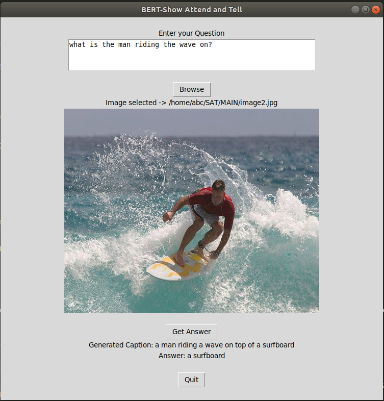

# Visual-Question-and-Answering
Image Captioning and Question Answering

Download pre trained model for BERT and Show Attend and Tell from below and paste it in respective folders (/BERT/pre_trained_model ans SAT/trained_model_SAT)
https://drive.google.com/drive/folders/14jLWiYUXIHy3WdMWurtl5ITSD05ajl7R?usp=sharing

Dataset to train BERT:
SQuAD = https://www.kaggle.com/stanfordu/stanford-question-answering-dataset

Dataset to train SAT:
MSCOCO '14 = https://cocodataset.org/#download
Or directly download the [Training (13GB)](http://images.cocodataset.org/zips/train2014.zip) and [Validation (6GB)](http://images.cocodataset.org/zips/val2014.zip) images.

Necessary steps before running:
1. /SAT/caption.py: Add correct path to model files in line 170 and 171.
2. /bert_sat.py: Set complete path for BERT MODEL in line 17.

Visual Question and Answering:
RUN bet_sat.py with python3. Browse image, put up a question and generate answer as show below.

